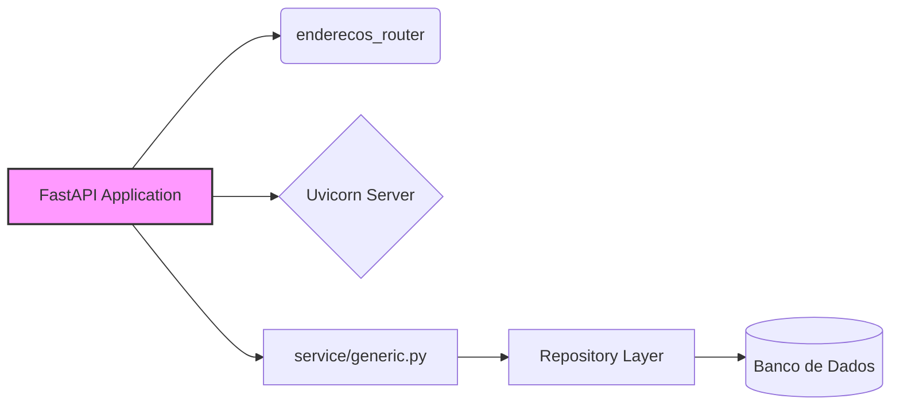

```markdown
# analise_heuristicas_integracoes.md

## Análise de Integrações e Dependências

Este documento detalha a análise das integrações, bibliotecas externas e APIs afetadas pelas mudanças no commit, juntamente com sugestões de melhorias.

### Contexto

O commit analisado contém modificações em dois arquivos: `main.py` e `service/generic.py`.  As mudanças são relativamente pequenas, mas fornecem um ponto de partida para avaliar a arquitetura e as possíveis integrações do sistema.

### Identificação de Integrações e Dependências

Com base nos arquivos modificados e na estrutura inferida do projeto, podemos identificar as seguintes integrações e dependências:

*   **FastAPI:** Framework web utilizado para construir a API. (Implícito em `main.py`)
*   **Uvicorn:** Servidor ASGI utilizado para executar a aplicação FastAPI localmente. (Mencionado no comentário em `main.py`)
*   **SQLAlchemy:**  Provavelmente utilizado como ORM (Object-Relational Mapper) para interagir com o banco de dados. (Inferido pela presença de `session: Session` em `service/generic.py` e pela necessidade de persistência de dados)
*   **Banco de Dados:** Um banco de dados relacional (ex: PostgreSQL, MySQL, SQLite) é utilizado para armazenar os dados. (Inferido pela utilização de SQLAlchemy e pela necessidade de persistência de dados)
*   **`enderecos_router`:** Um router específico para lidar com as rotas relacionadas a endereços. (Mencionado em `main.py`)
*   **`service/generic.py`:** Classe genérica para serviços CRUD, indicando uma camada de serviço para a lógica de negócios.
*   **`repository` (implícito):** Camada de acesso a dados que o `service/generic.py` provavelmente usa para interagir com o banco de dados.

**Mapa de Integrações:**



### Análise Detalhada e Sugestões

#### 1. FastAPI

*   **Análise:** FastAPI é uma excelente escolha para construir APIs modernas em Python devido à sua alta performance, tipagem estática e geração automática de documentação (Swagger/OpenAPI).
*   **Sugestões:**
    *   Certificar-se de que a versão do FastAPI utilizada é a mais recente estável para aproveitar as últimas correções de bugs e melhorias de desempenho.
    *   Explorar os recursos avançados do FastAPI, como dependências, middlewares e segurança.
    *   Implementar validação de dados usando Pydantic (integrado ao FastAPI) para garantir a integridade dos dados.

#### 2. Uvicorn

*   **Análise:** Uvicorn é um servidor ASGI rápido e confiável para aplicações Python.
*   **Sugestões:**
    *   Considerar o uso de um gerenciador de processos como Gunicorn em ambientes de produção para garantir alta disponibilidade e escalabilidade. Gunicorn pode gerenciar múltiplos workers Uvicorn.
    *   Configurar Uvicorn com o número apropriado de workers e threads para otimizar o desempenho da aplicação.
    *   Monitorar o desempenho do Uvicorn em produção para identificar gargalos e otimizar a configuração.

#### 3. SQLAlchemy

*   **Análise:** SQLAlchemy é um ORM poderoso e flexível que permite interagir com bancos de dados de forma eficiente.
*   **Sugestões:**
    *   Utilizar SQLAlchemy Core ou ORM dependendo da complexidade da aplicação. O Core oferece mais controle, enquanto o ORM facilita o desenvolvimento.
    *   Implementar migrações de banco de dados usando Alembic para controlar as mudanças no esquema do banco de dados.
    *   Otimizar as consultas SQLAlchemy para evitar gargalos de desempenho. Utilizar índices, eager loading e outras técnicas de otimização.
    *   Considerar o uso de um pool de conexões para gerenciar as conexões com o banco de dados de forma eficiente.

#### 4. Banco de Dados

*   **Análise:** A escolha do banco de dados depende dos requisitos da aplicação. PostgreSQL, MySQL e SQLite são opções comuns.
*   **Sugestões:**
    *   Escolher o banco de dados apropriado para as necessidades da aplicação. PostgreSQL é uma boa opção para aplicações complexas com requisitos de ACID, enquanto SQLite é adequado para aplicações menores e protótipos.
    *   Configurar o banco de dados corretamente para garantir alta disponibilidade, escalabilidade e segurança.
    *   Monitorar o desempenho do banco de dados em produção para identificar gargalos e otimizar a configuração.
    *   Implementar backups regulares do banco de dados para evitar perda de dados.

#### 5. `enderecos_router`

*   **Análise:** Este router encapsula a lógica para lidar com as rotas relacionadas a endereços.
*   **Sugestões:**
    *   Organizar o código do router em arquivos separados para facilitar a manutenção.
    *   Implementar testes unitários para garantir que as rotas funcionem corretamente.
    *   Documentar as rotas usando Swagger/OpenAPI para facilitar o consumo da API.

#### 6. `service/generic.py`

*   **Análise:** Classe genérica para serviços CRUD.
*   **Sugestões:**
    *   Adicionar tratamento de exceções mais específico para cada operação CRUD.
    *   Implementar logging para rastrear o fluxo de execução e identificar erros.
    *   Considerar o uso de um padrão de projeto como Unit of Work para garantir a consistência dos dados.

#### 7. `repository` (implícito)

*   **Análise:** Camada de acesso a dados que abstrai a interação com o banco de dados.
*   **Sugestões:**
    *   Implementar uma camada de repositório para separar a lógica de acesso a dados da lógica de negócios.
    *   Utilizar um padrão de projeto como Data Mapper para mapear os objetos de domínio para as tabelas do banco de dados.
    *   Implementar testes unitários para garantir que a camada de repositório funcione corretamente.

### Melhorias Gerais

*   **Documentação:** Criar documentação detalhada para todas as APIs e componentes do sistema.
*   **Testes:** Implementar testes unitários e de integração para garantir a qualidade do código.
*   **Logging:** Implementar logging para rastrear o fluxo de execução e identificar erros.
*   **Monitoramento:** Implementar monitoramento para coletar métricas sobre o desempenho do sistema e identificar gargalos.
*   **Segurança:** Implementar medidas de segurança para proteger o sistema contra ataques.

### Conclusão

As mudanças no commit são pequenas, mas fornecem um ponto de partida para avaliar a arquitetura e as possíveis integrações do sistema. Ao seguir as sugestões acima, é possível melhorar a escalabilidade, a manutenibilidade e a segurança do sistema.
```